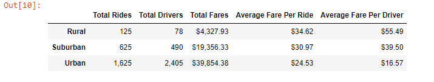
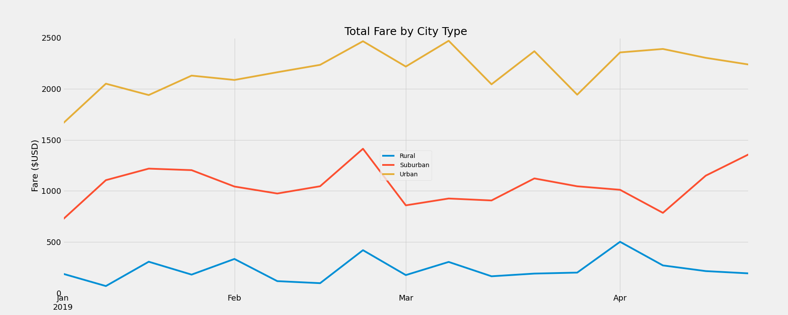

# PyBer_Analysis
## Overview of PyBer Analysis
An analysis was performed for CEO of ride-sharing app PyBer, V. Isualize, in order to provide clarity on the relationships between fare, number of drivers, number of rides given, and city type. The dataset analyzed was from January 2019 through May 2019 and was narrowed to emphasize the period of January 2019 through April 2019. Two deliverables were given: a) a summary DataFrame comparing the total rides, total drivers, total fares, average fares per ride, and average fares per driver according to city type; and b) a line chart comparing the weekly fares per city type January through April.
## Results

### Total Rides
As expected, urban areas showcased the largest number of rides, which correleates with the fact that urban areas tend to be the most populated. In addition, suburban and rural area residents are more likely to have transportation and would be less likely to require ride-sharing services.
### Total Drivers
In accordance with the above analysis, it is also logical that there would be less drivers in suburban and rural areas as the demand is less and the population is lower. It is interesting to note that despite having a far lower number of drivers, rural areas appear to have the most rides per driver.
### Total Fares
As predicted, urban areas produce the most total fare revenue, with urban fares accounting for 63% of total fares, suburban fares accounting for 30% of total fares, and rural fares accounting for 7% of total fares. This correlates with the trends previously discussed.
### Average Fare per Ride
The average fare per ride is much higher in rural areas and suburban areas than in urban areas. It would be interesting to see how drive time relates to this data, as it would be logical to assume that trips in rural areas would cover more distance than in urban areas.
### Average Fare per Driver
The average fare per driver is also much higher in rural areas. With a higher supply of drivers in urban areas, rates must become lower to stay appealing to customers. In rural areas, with a lower supply of drivers, those in need of ride-sharing services don't have much of a choice and will likely pay the price no matter what it is.
### Total Fare by City Type

In the chart above, total weekly fare revenues are compared according to city type.  It appears that all three types show an uptick in rides in late February and a subsequent decrease leading into March. Intrestingly, surburban fares show a sharp increase in the latter half of April whereas urban and rural fares decrease.
## Summary
### Recommendation 1
It is my recommendation that the CEO of Pyber provide more incentives to rural and surburban drivers, so that the total number of drivers increases and the average fare per ride decreases, creating a more accessible service that people asre more likely to utilize.
### Recommendation 2
In addition, it would be helpful to perform further analysis on why there are steep decreases in the last week of February so that a potential campaign could be launched to encourage more riders and drivers during that time, which would increase revenue.
### Recommendation 3
Lastly, it would be my recommendation to perform further analysis on why urban and rural cities see a decrease in the month of April, as well as why surburban areas see a sharp increase. Perhaps something is occuring in suburban areas during that time that could be implemented (or, perhaps incentivized) in rural or urban areas to provide the same positive results.
